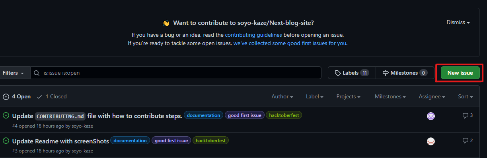
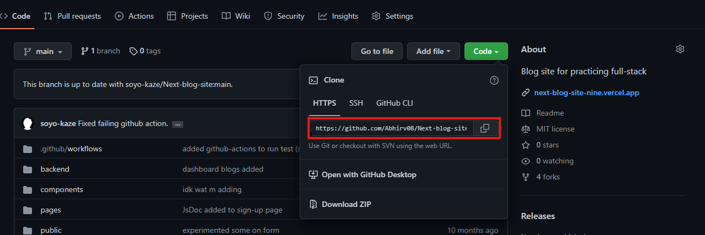
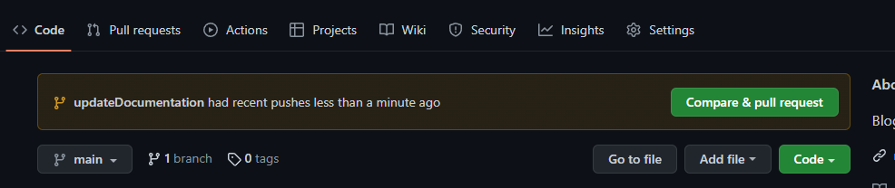
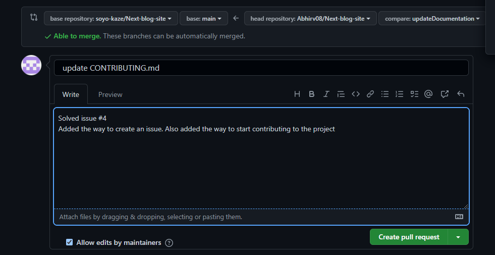

# Create a new Issue
- Click on the "New issue" button </br>
  

- Give a suitable title regarding the issue like "Update Readme.md", "Replace React context API with Redux", etc.

- Describe your issue. If you think there is need of any image for better explanation, attach image too.

- Then briefly explain what you are going to do to solve the issue.

# How to start with open source and raise your 1st PR

- Fork the repository <br />
  <br /> <br />

- Clone the repository using Git Command <br />
  <br/>  <br/>
  &nbsp; git clone https://github.com/{github_username}/Next-blog-site.git
- Move to the newly created folder using Git Command <br />
  &nbsp; ```cd Next-blog-site/```
  
- Make a new branch (always name your branch related to your issue) and then make the changes.<br/> To make a new branch, use Git Command
   <br/> &nbsp; ```git checkout -b {new branch name}```
   
- Open folder in your text editor maually or write command <br> &nbsp;```code .```

- Check your changes using Git Command
<br/> &nbsp; ```git status```

- Save your changes by using Git Command <br/>
&nbsp; ``` git add .```

- Commit your changes using command. Make sure to write short explaination of your changes in commit message.<br/>
 &nbsp; ```git commit -m "your_commit_message"```
 
- To push your changes to github. Use command
<br/> &nbsp; ```git push -u origin {branch name}``` 

## Raising Your 1st PR <br/>

- After pushing your code, go to the forked repository. There you will see a section like this. <br/>
 <br>

- Click on compare and pull request. Such page will appear. Write meaningful message and title which describes your changes (title should contain the issue number which you can see beside the title of issue)<br/>
<br/> 
- Click on create pull request. <br/>
